<picture>
  <source media="(max-width: 600px) and (prefers-reduced-motion: reduce)" srcset="./assets/static/mobile/hero.svg">
  <source media="(prefers-reduced-motion: reduce)" srcset="./assets/static/hero.svg">
  <source media="(max-width: 600px)" srcset="./assets/mobile/hero.svg">
  
</picture>

  <a href="#selected-work">Selected work</a> &nbsp; / &nbsp;
  <a href="#working-set">Working set</a> &nbsp; / &nbsp;
  <a href="#build-pulse">Build pulse</a> &nbsp; / &nbsp;
  <a href="#connect">Connect</a>

I'm **Saif Alshalabi**, a computer science student at **UNC Charlotte**. I build developer tools and explore applied AI. Right now, my main focus is **REPOT**: making it easier to bring useful features from one codebase into another.

## Selected work

<a href="https://github.com/shlbi/graft">
  <picture>
    <source media="(max-width: 600px) and (prefers-reduced-motion: reduce)" srcset="./assets/static/mobile/repot.svg">
  <source media="(prefers-reduced-motion: reduce)" srcset="./assets/static/repot.svg">
  <source media="(max-width: 600px)" srcset="./assets/mobile/repot.svg">
    
  </picture>
</a>

**Find the feature. Adapt it to your codebase. Review the change.**

REPOT connects source and destination repositories to a feature-transfer workflow, with an MCP integration for agent-based workflows and an explicit review step before draft-PR publication.

[Explore REPOT ↗](https://getrepot.com) &nbsp; · &nbsp; [Source code ↗](https://github.com/shlbi/graft) &nbsp; · &nbsp; [MCP documentation ↗](https://github.com/shlbi/graft#mcp)

<table>
<tr>
<td width="50%" valign="top">
<a href="https://github.com/shlbi/kinetic"><picture><source media="(prefers-reduced-motion: reduce)" srcset="./assets/static/kinetic.svg"></picture></a>
<h3>Kinetic</h3>

Interactive explainers where the simulation, displayed metrics, and exported video share one deterministic timeline.

<code>JavaScript</code> <code>Canvas</code> <code>Simulation</code>

<a href="https://github.com/shlbi/kinetic">Explore the project ↗</a>
</td>
<td width="50%" valign="top">
<a href="https://github.com/shlbi/osmo"><picture><source media="(prefers-reduced-motion: reduce)" srcset="./assets/static/osmo.svg"></picture></a>
<h3>OSMO</h3>

A pharmacokinetic research toolkit: kinetic models, chemistry-aware evaluation, and openly documented results and limitations.

<code>Python</code> <code>PyTorch</code> <code>Research</code>

<a href="https://github.com/shlbi/osmo">Explore the research ↗</a>
</td>
</tr>
</table>

## Working set

Tools I use and learn through projects and coursework.

| Area | In the mix |
| :--- | :--- |
| **Languages** | `Python` `JavaScript` `TypeScript` `Java` `C++` |
| **Web** | `HTML` `CSS` `Node.js` |
| **AI & data** | `NumPy` `SciPy` `Matplotlib` `Jupyter` |
| **Developer tooling** | `Git` `GitHub` `MCP` |

## Build pulse

<picture>
  <source media="(max-width: 600px)" srcset="./assets/mobile/activity.svg">
  
</picture>

<!-- ACTIVITY:START -->
<!-- Generated from public repository data; profile updates excluded. -->
Inspect the commits: <a href="https://github.com/shlbi/graft/commit/ab4ab7494d64e1951813a9dc6cfe998d6b5e729f">REPOT <code>ab4ab74</code> ↗</a> &nbsp; · &nbsp; <a href="https://github.com/shlbi/kinetic/commit/e56b5d5ad34269b0888bf2720170869b4123197c">Kinetic <code>e56b5d5</code> ↗</a> &nbsp; · &nbsp; <a href="https://github.com/shlbi/osmo/commit/c741889cf88cedc196dd616f896fd7209f315387">OSMO <code>c741889</code> ↗</a>
<!-- ACTIVITY:END -->

## Behind the builds

I'm interested in the gap between **“AI can generate code”** and **“this actually works in a real project.”** That is the space I'm exploring with REPOT.

I'm also learning more about machine learning, algorithms, and the systems underneath the tools we use. I like projects that force me to connect the theory to something I can run, inspect, and improve.

<strong>Open the lab notes</strong> &nbsp; ↗

 

**On my mind**  
Moving useful behavior between repositories. Giving AI agents better context and tools. Turning complicated ideas into interactive explanations.

**What I'm studying**  
Artificial intelligence, machine learning, operating systems, and data structures & algorithms.

**A question I keep coming back to**  
What useful thing still feels harder to build than it should?

## Connect

<picture>
  <source media="(max-width: 600px)" srcset="./assets/mobile/footer.svg">
  
</picture>

  
  &nbsp;
  

Saif Alshalabi · <a href="https://github.com/shlbi">@shlbi</a> · Charlotte, NC
